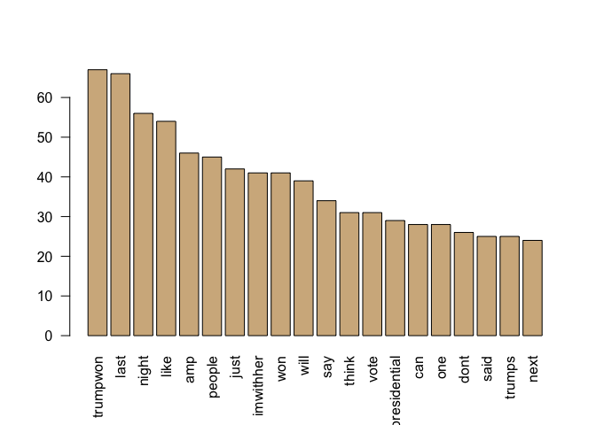

# Text Analysis of Election Tweets around the First Presidential Debate
Andy Pickering  
9/28/2016  


### Being in the middle (or I guess thankfully near the end!) of election season, I thought it would be interesting to examine tweets about the election.

Much of this analysis applies what I learned in a DataCamp course on text-mining: <https://www.datacamp.com/courses/intro-to-text-mining-bag-of-words>.

To collect the tweets, i'm using the rtweet package. The twitter API only lets you access tweets for the previous 7 days, so i've downloaded a collection of tweets spanning the first presidential debate and saved it as a csv file. 

Note that you will need to register for a (free) token to access the Twitter API. The creator of the rtweet package created a guide to doing this here: <https://github.com/mkearney/rtweet/blob/master/vignettes/tokens.Rmd>.

The code used to download the tweets was:


```r
library(rtweet)
# tweets with hashtag #debatenight from 9/25-9/28
tw1 <- search_tweets("#debatenight", n = 18000,since = "2016-09-25", until = "2016-09-28", token = twitter_token, lang = "en")
# save to csv file
save_as_csv(tw1,file_name='~/Tweets_Analysis/Data/debatenight_25_28')
```

Let's load one of the datasets and take a peek at it.

```r
tw <- read.csv('~/Tweets_Analysis/Data/debatenight_25_28.tweets.csv')
str(tw)
```

```
## 'data.frame':	17917 obs. of  23 variables:
##  $ created_at             : Factor w/ 3537 levels "2016-09-27 16:16:58",..: 1 2 3 3537 3537 3537 3537 3537 3536 3536 ...
##  $ status_id              : num  7.81e+17 7.81e+17 7.81e+17 7.81e+17 7.81e+17 ...
##  $ retweet_count          : int  4146 772 199 269 64058 99806 305 64058 22710 479 ...
##  $ favorite_count         : int  5382 870 405 0 0 0 0 0 0 0 ...
##  $ text                   : Factor w/ 4701 levels " #debatenight\n Trump\n #EdoDecides\n #KingsUniversityGhana\n Madrid\n\n2016/9/28 00:53 WAT #trndnl https://t.co/RztqeSY2ZJ",..: 348 649 975 2829 2331 2326 1611 2331 1993 1463 ...
##  $ in_reply_to_status_id  : num  NA NA NA NA NA NA NA NA NA NA ...
##  $ in_reply_to_user_id    : num  NA NA NA NA NA NA NA NA NA NA ...
##  $ in_reply_to_screen_name: Factor w/ 121 levels "1wh1tet1ger2",..: NA NA NA NA NA NA NA NA NA NA ...
##  $ is_quote_status        : logi  FALSE FALSE FALSE FALSE FALSE TRUE ...
##  $ quoted_status_id       : num  NA NA NA NA NA ...
##  $ source                 : Factor w/ 103 levels "AllLibertyNews",..: 13 60 93 88 88 88 88 88 88 82 ...
##  $ lang                   : Factor w/ 1 level "en": 1 1 1 1 1 1 1 1 1 1 ...
##  $ user_id                : num  1.91e+07 7.59e+05 3.10e+07 7.27e+17 2.67e+09 ...
##  $ screen_name            : Factor w/ 14441 levels "_____Daphne",..: 11710 2996 8236 12198 758 5577 4366 7333 4300 8691 ...
##  $ mentions_user_id       : Factor w/ 2635 levels "100649666","101108859",..: NA NA NA 170 187 187 2003 187 114 2548 ...
##  $ mentions_screen_name   : Factor w/ 2635 levels "_AnimalAdvocate",..: NA NA NA 1394 952 952 402 952 678 281 ...
##  $ hashtags               : Factor w/ 1375 levels "22die debatenight",..: 156 156 154 156 156 154 479 156 154 154 ...
##  $ urls                   : Factor w/ 1215 levels "http://4hwg.com/aya/gov/16.php",..: NA 131 926 NA NA 1008 NA NA 964 NA ...
##  $ is_retweet             : logi  FALSE FALSE FALSE TRUE TRUE TRUE ...
##  $ retweet_status_id      : num  NA NA NA 7.81e+17 7.81e+17 ...
##  $ place_name             : Factor w/ 87 levels "Aberystwyth, Wales",..: NA NA NA NA NA NA NA NA NA NA ...
##  $ country                : Factor w/ 8 levels "Australia","Canada",..: NA NA NA NA NA NA NA NA NA NA ...
##  $ coordinates            : Factor w/ 88 levels "-0.15191 -0.078902 -0.078902 -0.15191 51.410792 51.410792 51.509887 51.509887",..: NA NA NA NA NA NA NA NA NA NA ...
```

There are a lot of variables returned by the rtweet package; let's clean it up a bit by removing some columns we won't use:

```r
tw2<-tw[,-c(2:4,6:18,20:23)]
str(tw2)
```

```
## 'data.frame':	17917 obs. of  3 variables:
##  $ created_at: Factor w/ 3537 levels "2016-09-27 16:16:58",..: 1 2 3 3537 3537 3537 3537 3537 3536 3536 ...
##  $ text      : Factor w/ 4701 levels " #debatenight\n Trump\n #EdoDecides\n #KingsUniversityGhana\n Madrid\n\n2016/9/28 00:53 WAT #trndnl https://t.co/RztqeSY2ZJ",..: 348 649 975 2829 2331 2326 1611 2331 1993 1463 ...
##  $ is_retweet: logi  FALSE FALSE FALSE TRUE TRUE TRUE ...
```

More cleaning: keep only the tweets that were not retweets, and remove username mentions from the tweets: 

```r
suppressMessages(library(dplyr))
dim(tw2)
```

```
## [1] 17917     3
```

```r
tw2 <- tw2 %>% filter(is_retweet == FALSE) %>%
        mutate(text = gsub("\\@.*", "", text)) 
dim(tw2)
```

```
## [1] 1470    3
```
We can see that this greatly reduces the number of tweets (indicating many were retweets).

## Cleaning Text and Making a Corpus

Let's take a look at the text of the first few tweets:

```r
head(tw2)$text
```

```
## [1] "#DebateNight summarized https://t.co/8A6fwdXuiW"                                                                                             
## [2] "Donald Trump: \"I'm smart\" for not paying taxes https://t.co/jOFf6qCNbZ #DebateNight https://t.co/dm0BQ2s7NM"                               
## [3] "My all-time favorite meme has a new #debatenight incarnation https://t.co/V6u7FfRoxY"                                                        
## [4] "#DebateNight: Google Searches for Clinton Surpass Trump\n\nhttps://t.co/beFWZ2bZsG\n\n#SheWon "                                              
## [5] "So, #Trump wants to dump all these govt departments but doesn't say how he's going to make up for the jobs he'd be cutting...\n #debatenight"
## [6] "When they said you're not allowed to talk when someone else is #debatenight https://t.co/ElmJTlRCNz"
```

We need to clean up the tweets text before doing some analysis.. I'm going to use the tm package for this. Some of the cleaning includes: 

* Remove whitespace
* Remove punctuation
* Make all lowercase
* Remove common words


```r
library(tm)
```

```
## Loading required package: NLP
```

```r
# 1st need to interpret each element in tweets as a document
tweet_source <- VectorSource(tw2$text)

# Then make a corpus
tweet_corpus <- VCorpus(tweet_source)

# Define a function to do some basic cleaning of the corpus text
clean_corpus <- function(corpus){
        corpus <- tm_map(corpus, stripWhitespace)
        corpus <- tm_map(corpus, removePunctuation)
        corpus <- tm_map(corpus, content_transformer(tolower) )
        corpus <- tm_map(corpus, removeWords, c(stopwords("en"), "#DebateNight","debatenight","debates","debate","debates2016","https","clinton","hillaryclinton","donald","trump","hillary","donaldtrump"))
        return(corpus)
}

# Apply your customized function to the tweet_corp: clean_corp
clean_corp <- clean_corpus(tweet_corpus)
```

### Compare a tweet before and after to illustrate cleaning effects

```r
id<-400
tw2$text[id]
```

```
## [1] "Donald Trump: I will release my taxes when Clinton releases her deleted emails #DebateNight"
```

```r
clean_corp[[id]]$content
```

```
## [1] "   will release  taxes   releases  deleted emails "
```

### Make a term document matrix

```r
# Make a term document = matrix
tweet_dtm <- TermDocumentMatrix(clean_corp)
```

## Frequent Terms Barplot

```r
# convert to a matrix
tweet_m <- as.matrix(tweet_dtm)

# barplot of frequent terms
term_frequency <- rowSums(tweet_m)

# Sort term_frequency in descending order
term_frequency <- sort(term_frequency,decreasing=TRUE)

# View the top 10 most common words
term_frequency[1:10]
```

```
##  trumpwon      last     night      like       amp    people      just 
##        67        66        56        54        46        45        42 
## imwithher       won      will 
##        41        41        39
```

```r
# Plot a barchart of the most common words
barplot(term_frequency[1:20],col="tan",las=2,horiz=FALSE)
```

<!-- -->

## Wordclouds


```r
library(wordcloud)
```

```
## Loading required package: RColorBrewer
```

```r
# Print the first 10 entries in term_frequency
term_frequency[1:10]
```

```
##  trumpwon      last     night      like       amp    people      just 
##        67        66        56        54        46        45        42 
## imwithher       won      will 
##        41        41        39
```

```r
# Create word_freqs
word_freqs <- data.frame(term=names(term_frequency),num=term_frequency)

# Create a wordcloud for the values in word_freqs
wordcloud(word_freqs$term,word_freqs$num,max.words=40,colors="red")
```

```
## Warning in wordcloud(word_freqs$term, word_freqs$num, max.words = 40,
## colors = "red"): trumpwon could not be fit on page. It will not be plotted.
```

<!-- -->

### We can make this a little nicer by adding a colormap to the image.

```r
## Add colors to the wordcloud
# Create purple_orange
purple_orange <- brewer.pal(10,"PuOr")

# Drop 2 faintest colors
purple_orange <- purple_orange[-(1:2)]

# Create a wordcloud with purple_orange palette
wordcloud(word_freqs$term,word_freqs$num,max.words=40,colors=purple_orange)
```

<!-- -->

### Issues/Lessons Learned
* Lots of the original tweets I gathered were retweets. Is there a way to not return retweets in the search?
* Need to remove hashtags from tweets
* Seems like there are still a lot of common words showing up in the most frequent terms and wordclouds; I will try using a tf-idf scheme to discount words that show up in most of the tweets and emphasize the differences.
* I'd also like to make a comparison cloud to contrast different groups (for example Trump supporters vs Clinton supporters, or tweets by Trump and Clinton themselves).


